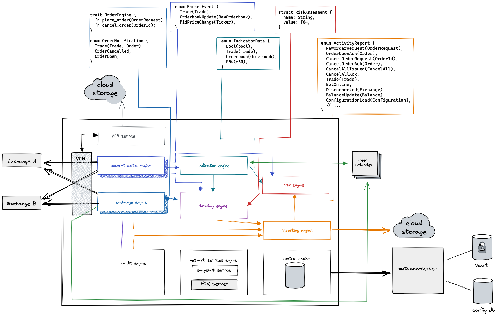

# Botvana: high-performance trading platform

Botvana is an open-source, event-driven, and distributed trading platform targeting
crypto markets. It aims to be high-performance, low-latency, reliable, and
fault-tolerant. Built in Rust, it allows you to develop and operate market-making
and arbitrage strategies.


⚠️ The project is still in very early development ⚠️

## Principles:

-   **High-performance:** Designed and architected to be high-performance from the
    ground up. It utilizes thread-per-core architecture to take advantage of
    modern multicore CPUs.
-   **Low-latency**: Currently utilizing `io_uring` for network connectivity, with
    goals to use `AF_XDP` or kernel by-pass in the future.
-   **Reliable**: Being built in Rust provides Botvana with memory safety guarantees
    compared to other systems programming languages.
-   **Fault-tolerant:** Crypto exchanges are known for unreliability, so Botvana
    provides explicit fault-tolerant features.

## Overview

Botvana is split into these components:

-   `botnode`: high-performance trading bot
-   `botvana-server`: coordination server
-   `botvana`: shared platform definitions
-   `station-egui`: control application

### Supported Exchanges

Currently, in the early phase of the project, the supported exchanges are FTX and
Binance.

### botnode architecture



Botnode uses thread-per-core architecture where each thread is pinned to exactly
one logical CPU core. Each CPU core runs a different engine with a custom event loop.
Data is sent between engines using SPSC channels, and no global state is shared
between the threads.

Botnode has these engines:

- **Control engine:** Connects to `botvana-server` and spawns all other engines
  based on configuration.
- **Market data engine:** Connects to the exchange and transforms market data to
  Botvana's internal types.
- **Indicator engine:** Provides indicators built from market data.
- **Trading engine:** Makes trading decisions.
- **Exchange engine:** Acts as order router and gateway to the exchange.
- **Audit engine:** Audits trading activity.

### botvana-server

Each `botnode` needs to connect to a central `botvana-server` which provides
configuration and acts as the central coordinator.

Botvana server expects configuration in `cfg/default.toml`.

### station-egui

Control station application written using egui framework.

## Development Prerequisites

In order to work with Botvana you need to have:

-   Linux kernel version >5.13
-   Rust 1.56 or higher
-   Terraform

## Getting started

1.  Clone the repo
    ```sh
    git clone https://github.com/featherenvy/botvana.git
    ```
2.  Install dependencies required to compile `egui`
    ```sh
    sudo apt-get install libxcb-render0-dev libxcb-shape0-dev libxcb-xfixes0-dev libspeechd-dev libxkbcommon-dev libssl-dev
    ```
3.  Build all components
    ```sh
    cargo build
    ```
4.  Run `botvana-server`
    ```sh
    cargo r --bin botvana-server
    ```
5.  Run `botnode`
    ```sh
    SERVER_ADDR=127.0.0.1:7978 BOT_ID=0 cargo r --bin botnode
    ```
